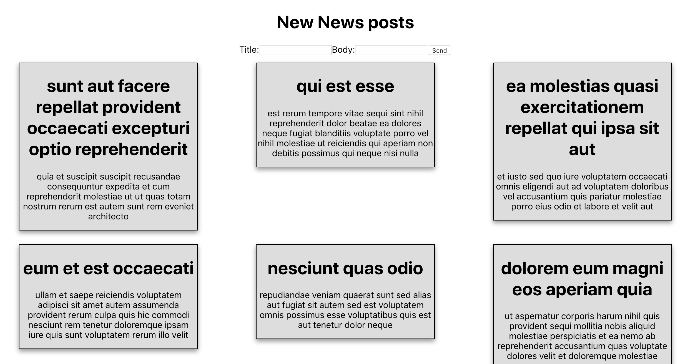

[](https://generalassemb.ly/education/web-development-immersive) 


# Axios with React


## Running this:

This project was created with [`create-react-app`](https://facebook.github.io/create-react-app/docs/getting-started). Once you have the app cloned, you should run `npm install`. You can then run it with `npm start`.

### Big Goal:

Create a react app that render Posts form external API. Through this code along we will cover the best place can call an API inside Component Life cycle.

### API URL:

We will use this fake API to build our App.
```js
const apiURL = 'https://jsonplaceholder.typicode.com/posts/';
```

### Final result: 

